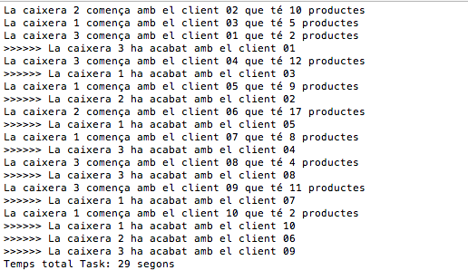

# UF2Practica1: Pràctica Threads
##Enunciat
En aquest exercici volem simular el procés de cobrament d'un supermercat: una cua de clients amb un carret amb un nombre de productes i una línia de caixes amb un nombre de caixeres determinat amb un sistema de cua única, els clients es van repartint a les diferents caixes, conforme van quedan lliures.

Es defineix una classe "Client" que té dos atributs: IdClient un string per poder identificar el client i nProductes de tipus int que indica quants articles té al carret.

Es defineix una classe "Caixera" que té com atribut un int Id per identificar cada caixa i tres mètodes:
"GestionarCua" on cada caixera extreu el nou Client a atendre de la cua
"GestionarCompra" on bàsicament es mostra un missatge indicant quina caixera gestionarà al client X i on hi ha un bucle per simular el pas dels diferents articles per l'escàner.
"GestioProducte" simula el procés de l'escàner i introdueix una espera de 1 s.

La llista de clients es troba a un arxiu CSV CuaClients.csv on cada fila consta de dos camps separats per ; indicant el IdClient i el nombre de articles:

 > 01;12
 
 > 02;5
 
 > 03;7
 
 > ...
 
L'arxiu ja es troba a la *ruta bin/debug* del vostre projecte però podeu fer proves creant d'altres arxius!

Aquestes dades es carreguen a un cua concurrent *ConcurrentQueue* que permet que els diferents Threads accedeixin a la cua sense que es presentin problemes de concurrència. Les dues accions que es faran sobre aquesta cua serà afegir elements *Enqueue(element)* i extreure elements de la cua *TryDequeue(out element)*. En teniu més informació sobre aquestes col·leccions a [MDSN ConcurrentQueue](https://msdn.microsoft.com/en-us/library/dd267265(v=vs.110).aspx)
 
 
 Cal que completeu el codi per tal que el programa funcioni amb un Thread per cadascuna de les caixeres. Obtenint un resultat com el següent:
 
 
##Procediment
Per començar heu de fer un Fork al vostre GitHub i treballar a partir del vostre fork clonant-lo en el vostre ordinador, **no cloneu directament aquest repositori al vostre ordinador**

Habitueu-vos a fer commits i git push cada cop que codifiqueu una part del problema, sobretot cada dia al finalitzar la feina.

##Lliurament
Per lliurar la pràctica, un cop tingueu la solució definitiva al vostre repositori GitHub feu un **New Pull Request**. Fareu una defensa de la pràctica on mostrareu el funcionament i on haureu de respondre les preguntes per part dels professors.

Al moodle pugeu el projecte en format ZIP. Es recomana que feu diverses proves amb diferents arxius CSV que podeu crear vosaltres.

